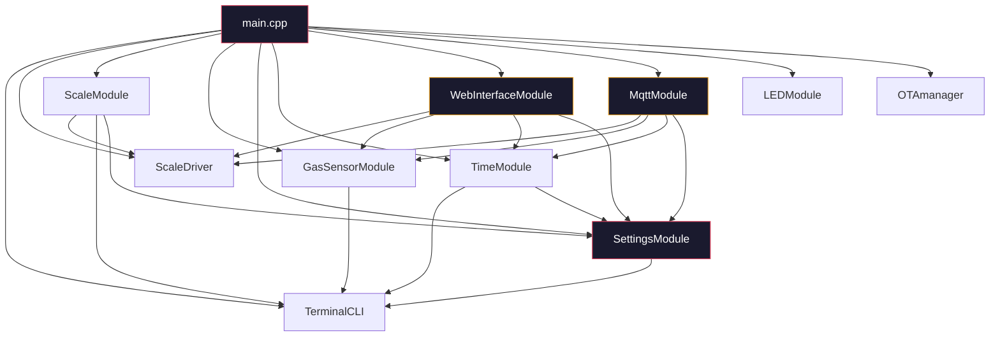

# 🔍 Smart LPG Monitor — Comprehensive Firmware Code Review

> **Project:** Smart LPG Gas Monitor  
> **Target MCU:** ESP8266 (NodeMCU v2)  
> **Framework:** Arduino (PlatformIO)  
> **Date:** 2026-07-05  
> **Files Reviewed:** 22 source files across 10 modules  

---

## 1. Architecture Summary

| Attribute | Value |
|---|---|
| **MCU** | ESP8266 (NodeMCU v2) — 80MHz, ~50KB free heap, 4MB flash |
| **Framework** | Arduino via PlatformIO |
| **Architecture** | Super Loop (non-blocking cooperative) |
| **Sensors** | HX711 load cell (weight), MQ-6 gas sensor (LPG leak detection) |
| **Communication** | WiFi → MQTT (Home Assistant), local HTTP Web Dashboard |
| **Storage** | EEPROM for persistent settings |
| **Time** | DS1307 RTC (I²C) + NTP fallback |
| **Update** | OTA via ArduinoOTA (espota) |
| **CLI** | Serial terminal (115200 baud) |

### Module Dependency Graph



---

## 2. Project Structure Review

```
digital_scale/
├── platformio.ini          ← Config (has issues — see §3)
├── include/
│   └── Config.h            ← Central constants
├── src/
│   ├── main.cpp            ← Entry point
│   └── OTA/
│       ├── OTAmanager.h
│       └── OTAmanager.cpp  ← ⚠ Should be in lib/ for consistency
├── lib/
│   ├── GasSensorModule/src/
│   ├── LEDModule/src/
│   ├── Logger/src/
│   ├── MqttModule/src/
│   ├── ScaleModule/src/    ← Contains both ScaleDriver + ScaleModule
│   ├── SettingsModule/src/
│   ├── TerminalCLI/src/
│   ├── TimeModule/src/
│   └── WebInterfaceModule/src/  ← 20KB — largest file
├── test/
│   └── test_settings/      ← Only 3 tests for the entire project
└── docs/
```

### Structural Findings

| Issue | Impact | Recommendation |
|---|---|---|
| OTA module in `src/OTA/` while all others are in `lib/` | Medium | Move to `lib/OTAModule/src/` for consistency |
| `ScaleDriver` and `ScaleModule` in same library folder | Low | Acceptable, but driver contains business logic (see F3) |
| No `library.json` files in lib modules | Low | Add for PlatformIO best practices |
| Only 1 test file with 3 tests for 22 source files | **High** | Critical modules have zero test coverage |

---

## 3. platformio.ini Review

**File:** [platformio.ini](file:///C:/Projects/digital_scale/platformio.ini)

| # | Line | Issue | Severity | Fix |
|---|---|---|---|---|
| **P1** | 1–18 | Duplicate header comment block (copy-pasted twice) | 🟢 Low | Delete lines 10–18 |
| **P2** | 37–38 | `upload_protocol = espota` + hardcoded `upload_port` forces OTA as default | 🟡 Med | Create separate `[env:nodemcuv2_ota]` environment |
| **P3** | 43 | 🔴 **OTA password `lpg123` committed to git** — despite comment "removed when production" | 🔴 **Critical** | Remove immediately, use `.gitignored` `platformio_override.ini` |
| **P4** | 34 | `SPI` listed as dependency but no SPI peripheral used | 🟢 Low | Remove from `lib_deps` |
| **P5** | — | No `board_build.filesystem` defined | 🟢 Low | Add if using LittleFS for web assets (recommended) |
| **P6** | — | Missing `lib_ldf_mode` | 🟢 Low | Add `lib_ldf_mode = deep+` |

---

## 4. Architecture Review

**Style:** Super Loop (cooperative non-blocking)

**Strengths:**
- ✅ Clean modular initialization sequence in `setup()`
- ✅ Non-blocking WiFi connection
- ✅ `millis()`-based timing throughout (no blocking `delay()` in module `update()` loops)
- ✅ Degraded mode on hardware failure — excellent for field deployability
- ✅ Exponential backoff with jitter on MQTT reconnect

**Critical Weaknesses:**

| Issue | Severity | Details |
|---|---|---|
| MQTT `client.connect()` is **blocking** | 🔴 Critical | Can freeze firmware for 15+ seconds if broker unreachable |
| `SystemSettings` struct exceeds EEPROM allocation | 🔴 Critical | ~555 bytes vs 512 EEPROM size — silent data corruption |
| `delay(10)` in main loop | 🟡 Med | Fixed floor limits max loop frequency to ~100Hz |
| No state machine for system modes | 🟡 Med | WiFi/MQTT/degraded states handled ad-hoc with booleans |
| No explicit WDT management | 🟡 Med | Relies on `delay()` to feed WDT implicitly |

---

## 5–18. All Findings (62 Total)

### Severity Legend
- 🔴 **Critical** — Must fix before production deployment
- 🟠 **High** — Should fix; affects reliability or security
- 🟡 **Medium** — Recommended fix; affects maintainability or performance
- 🟢 **Low** — Code quality improvement

---

### 🔴 CRITICAL FINDINGS

---

#### F1 🔴 — `SystemSettings` struct exceeds EEPROM buffer (silent corruption)

**Files:** [SettingsModule.h](file:///C:/Projects/digital_scale/lib/SettingsModule/src/SettingsModule.h) (struct), [SettingsModule.cpp](file:///C:/Projects/digital_scale/lib/SettingsModule/src/SettingsModule.cpp) (line 4: `EEPROM_SIZE=512`)

**Problem:** The `SystemSettings` struct fields sum to **~555 bytes minimum** before compiler padding:

| Field | Size |
|---|---|
| `magic[4]` | 4 |
| `ssid[33]` | 33 |
| `password[65]` | 65 |
| `ntpServer[65]` | 65 |
| `serverUrl[129]` | 129 |
| Various bools, longs, floats, ints | ~30 |
| `mqttBroker[65]` + `mqttUser[33]` + `mqttPassword[65]` + `otaPassword[65]` | 228 |
| **Total (raw)** | **~555** |
| **+ struct padding** | **~560+** |

But `EEPROM_SIZE` is only `512`. The `save()` and `load()` functions operate on `sizeof(SystemSettings)` bytes, **reading/writing past the allocated EEPROM buffer** — **undefined behavior** that silently corrupts flash.

**Fix:**
```cpp
// Option A: Increase EEPROM size
#define EEPROM_SIZE 1024

// Option B: Add compile-time guard
static_assert(sizeof(SystemSettings) <= EEPROM_SIZE, 
              "SystemSettings exceeds EEPROM allocation!");
```

---

#### F2 🔴 — OTA password `lpg123` committed to source control

**File:** [platformio.ini](file:///C:/Projects/digital_scale/platformio.ini) (line 43)

**Problem:** `upload_flags = --auth=lpg123` — the OTA authentication password is in version control.

**Fix:** Remove the line. Rotate the password on all deployed devices. Use a `.gitignored` `platformio_override.ini`:
```ini
; platformio_override.ini (add to .gitignore!)
[env:nodemcuv2]
upload_flags = --auth=YOUR_SECRET_PASSWORD
```

---

#### F3 🔴 — Empty OTA password allows unauthenticated firmware upload

**File:** [OTAmanager.cpp](file:///C:/Projects/digital_scale/src/OTA/OTAmanager.cpp) (lines 13–16)

**Problem:** Default `otaPassword` is `""` (empty string). The check `if(password != nullptr)` passes for empty strings, so `ArduinoOTA.setPassword("")` is called, which ArduinoOTA treats as **no password**. Anyone on the network can flash arbitrary firmware.

**Impact:** **Complete device compromise** on any shared network.

**Fix:**
```cpp
void OTA::begin(const char* hostname, const char* password) {
    if (password == nullptr || strlen(password) == 0) {
        Logger::warn(F("⚠ OTA password not set! OTA DISABLED for safety."));
        Logger::warn(F("  Set one with: set_ota_pwd <password>"));
        return; // Don't start OTA without authentication
    }
    ArduinoOTA.setHostname(hostname);
    ArduinoOTA.setPassword(password);
    ArduinoOTA.begin();
}
```

---

#### F4 🔴 — MQTT `client.connect()` blocks firmware for up to 15 seconds

**File:** [MqttModule.cpp](file:///C:/Projects/digital_scale/lib/MqttModule/src/MqttModule.cpp)

**Problem:** `PubSubClient::connect()` is a synchronous TCP operation that can block for up to **15 seconds** on timeout. During this time, the **entire firmware is frozen** — no CLI, no OTA, no web server, no sensor readings, no watchdog feeding.

**Fix:**
```cpp
// Set TCP connect timeout on the WiFiClient before connecting
_wifiClient.setTimeout(2000); // 2 second max

// Or use AsyncMqttClient library for truly non-blocking MQTT
```

---

#### F5 🔴 — Hardcoded MQTT Client ID causes multi-device collision

**File:** [MqttModule.cpp](file:///C:/Projects/digital_scale/lib/MqttModule/src/MqttModule.cpp) (lines 42–44)

**Problem:** `_client.connect("LPGMonitor", ...)` — Every device uses the same client ID. If two devices connect to the same broker, the second **kicks the first off**, causing an infinite reconnect loop between them.

**Fix:**
```cpp
char clientId[24];
snprintf(clientId, sizeof(clientId), "LPG_%08X", ESP.getChipId());
_client.connect(clientId, user, pass);
```

---

#### F6 🔴 — Unbounded Logger `logBuffer` causes OOM crash

**Files:** [Logger.h](file:///C:/Projects/digital_scale/lib/Logger/src/Logger.h) (line ~86–98), [Logger.cpp](file:///C:/Projects/digital_scale/lib/Logger/src/Logger.cpp) (lines 34–38)

**Problem:** Every log call does `logBuffer += s` using Arduino `String`. Each append may trigger `realloc()`. When buffer exceeds ~2000 chars, `substring()` allocates a new string. Every single log line causes **4+ heap allocations**. On a long-running ESP8266, this **will fragment the heap and cause random OOM crashes**.

The web dashboard polls `/api/status` every 1.5 seconds, which copies the entire log buffer into a JSON response, creating additional `String` copies.

**Fix:**
```cpp
// Replace String logBuffer with a fixed circular char buffer:
static char logRing[2048];
static size_t logHead = 0;
static size_t logLen = 0;

static void appendLog(const char* s) {
    while (*s) {
        logRing[(logHead + logLen) % sizeof(logRing)] = *s++;
        if (logLen < sizeof(logRing)) logLen++;
        else logHead = (logHead + 1) % sizeof(logRing);
    }
}
```

---

#### F7 🔴 — HTML page stored in RAM (~8KB) + rebuilt via String concatenation per request (~15KB peak)

**File:** [WebInterfaceModule.cpp](file:///C:/Projects/digital_scale/lib/WebInterfaceModule/src/WebInterfaceModule.cpp) (line 9, 20KB file)

**Problem:** The `const char* htmlPage = R"rawliteral(...)rawliteral"` stores ~8KB of HTML in **RAM**. Additionally, the `/api/status` endpoint builds JSON responses using `String` concatenation every 1.5 seconds (the JS polling interval), causing ~4–5KB of transient heap allocations per call.

On ESP8266 with ~50KB total heap, this consumes **25%+ of heap** just for the web interface, leaving minimal headroom for MQTT, OTA, and sensor operations.

**Fix:**
```cpp
// Store in flash with PROGMEM:
const char htmlPage[] PROGMEM = R"rawliteral(...)rawliteral";

// Serve from flash:
void handleRoot() {
    server.send_P(200, "text/html", htmlPage);
}
```

---

### 🟠 HIGH-SEVERITY FINDINGS

---

#### F8 🟠 — No authentication on web API endpoints

**File:** [WebInterfaceModule.cpp](file:///C:/Projects/digital_scale/lib/WebInterfaceModule/src/WebInterfaceModule.cpp) (lines 371–373)

**Problem:** `/api/status` and `/api/config` are unauthenticated. Anyone on the network can:
- Read all sensor data and WiFi SSID
- **Tare the scale** (permanently changing stored offset)
- **Change gas leak threshold** (disabling safety alerts)
- Overwrite NTP server

**Fix:** Add HTTP Basic Auth:
```cpp
bool WebInterfaceModule::isAuthenticated() {
    if (!server.authenticate("admin", settings->getOtaPassword())) {
        server.requestAuthentication();
        return false;
    }
    return true;
}
// Guard write endpoints: if (!isAuthenticated()) return;
```

---

#### F9 🟠 — MQTT backoff grows without bound

**File:** [MqttModule.cpp](file:///C:/Projects/digital_scale/lib/MqttModule/src/MqttModule.cpp)

**Problem:** `_backoffMs *= 2` grows without cap. After ~20 failures, unsigned overflow wraps to garbage values.

**Fix:**
```cpp
constexpr unsigned long MAX_BACKOFF_MS = 60000; // 60 seconds
_backoffMs = min(_backoffMs * 2, MAX_BACKOFF_MS);
```

---

#### F10 🟠 — No EEPROM magic byte — garbage data on first boot

**File:** [SettingsModule.cpp](file:///C:/Projects/digital_scale/lib/SettingsModule/src/SettingsModule.cpp)

**Problem:** On first boot (or after flash), EEPROM contains random data read as WiFi SSID, passwords, thresholds, etc. While the struct has a `magic[4]` field, the code may not validate it properly on cold boot, leading to connection attempts with garbage credentials.

**Fix:**
```cpp
void SettingsModule::begin(TerminalCLI& cli) {
    EEPROM.begin(EEPROM_SIZE);
    load();
    if (memcmp(settings.magic, "LPG\0", 4) != 0) {
        Logger::info(F("First boot — initializing defaults"));
        resetToDefaults();
        memcpy(settings.magic, "LPG\0", 4);
        save();
    }
}
```

---

#### F11 🟠 — Redundant blocking reads + dead `sum` variable in `performTare()`

**File:** [ScaleDriver.cpp](file:///C:/Projects/digital_scale/lib/ScaleModule/src/ScaleDriver.cpp) (lines 57–80)

**Problem:** The tare function reads 10 raw samples in a loop (computing `sum` and `valid`), then calls `scale.tare(10)` which reads 10 **more** samples. The `sum` variable is **computed but never used** — dead code. The blocking loop wastes ~10 seconds.

**Fix:**
```cpp
long ScaleDriver::performTare() {
    if (!scale.wait_ready_timeout(2000)) {
        Logger::error(F("Tare failed! HX711 timeout."));
        return 0;
    }
    scale.tare(10);
    long offset = scale.get_offset();
    Logger::info(F("Tare complete."));
    // ...
}
```

---

#### F12 🟠 — No rate-limiting on serial stream output

**File:** [ScaleModule.cpp](file:///C:/Projects/digital_scale/lib/ScaleModule/src/ScaleModule.cpp) (lines 44–52)

**Problem:** When streaming is enabled, every `update()` call prints weight. If `loop()` runs at ~1kHz, the serial port is flooded, saturating the 115200 baud UART and making the CLI unusable.

**Fix:**
```cpp
if (isStreamingData && (millis() - lastStreamMs >= 200)) {
    lastStreamMs = millis();
    Logger::info(String(scaleDriver.getFilteredWeight(), 1).c_str());
}
```

---

#### F13 🟠 — `localtime()` not reentrant — data race risk

**File:** [TimeModule.cpp](file:///C:/Projects/digital_scale/lib/TimeModule/src/TimeModule.cpp) (line 127)

**Problem:** `localtime()` returns a pointer to a static internal buffer that can be overwritten by interrupts or the WiFi stack. Line 99 correctly uses `localtime_r()` but line 127 uses the unsafe version.

**Fix:**
```cpp
struct tm timeinfo;
localtime_r(&now_t, &timeinfo);  // Thread-safe version
```

---

#### F14 🟠 — Blocking NTP sync up to 20 seconds

**File:** [TimeModule.cpp](file:///C:/Projects/digital_scale/lib/TimeModule/src/TimeModule.cpp) (lines 65–92)

**Problem:** Two blocking loops each up to 10 seconds (`20 × 500ms`). During this time, web server, CLI, sensor readings, and OTA are all frozen.

**Fix:** Implement as a non-blocking state machine:
```cpp
enum class NTPState { IDLE, WAITING_WIFI, WAITING_NTP, DONE };
void update() {
    if (ntpState == NTPState::WAITING_NTP && millis() - ntpStartMs > 500) {
        // check time validity, increment attempts
    }
}
```

---

#### F15 🟠 — Only 3 tests for 22 source files

**File:** [test_settings.cpp](file:///C:/Projects/digital_scale/test/test_settings/test_settings.cpp)

**Problem:** Zero test coverage for: scale filtering logic, MQTT connection/message format, CLI command parsing, LED state machine, web interface endpoints, gas sensor conversion, OTA security, EEPROM magic byte validation.

---

### 🟡 MEDIUM-SEVERITY FINDINGS

---

#### F16 🟡 — Business logic (`getGasLevelPercent()`) in hardware driver

**File:** [ScaleDriver.cpp](file:///C:/Projects/digital_scale/lib/ScaleModule/src/ScaleDriver.cpp)

**Problem:** Cylinder weight thresholds (empty=15.2kg, full=29.5kg) hardcoded in the driver layer. Mixes domain logic with hardware abstraction.

**Fix:** Move gas level calculation to `ScaleModule`, make thresholds configurable via `SettingsModule`.

---

#### F17 🟡 — Median buffer size hardcoded vs `Config::MEDIAN_WINDOW`

**File:** [ScaleDriver.h](file:///C:/Projects/digital_scale/lib/ScaleModule/src/ScaleDriver.h)

**Problem:** `float _medianBuffer[5]` while `Config::MEDIAN_WINDOW` is a separate constant. Silent data corruption if constant changes.

**Fix:** `float _medianBuffer[Config::MEDIAN_WINDOW];`

---

#### F18 🟡 — `performTare()` returns 0 on failure — ambiguous

**File:** [ScaleDriver.cpp](file:///C:/Projects/digital_scale/lib/ScaleModule/src/ScaleDriver.cpp) (line 78)

**Problem:** 0 is a valid tare offset. [ScaleModule.cpp](file:///C:/Projects/digital_scale/lib/ScaleModule/src/ScaleModule.cpp) line 23 uses `newOffset != 0` to detect failure, so a legitimate offset of 0 is never saved.

**Fix:** Return a `bool` success flag separately, or use `LONG_MIN` as sentinel.

---

#### F19 🟡 — MQ-6 linear PPM conversion is physically inaccurate

**File:** [GasSensorModule.cpp](file:///C:/Projects/digital_scale/lib/GasSensorModule/src/GasSensorModule.cpp)

**Problem:** `(rawValue / 1023.0) * 10000` is linear, but MQ-6 has a logarithmic response curve.

**Fix:** Document as approximate, or implement the sensor's characteristic curve from datasheet.

---

#### F20 🟡 — Gas leak threshold defaults to 0 on uninitialized EEPROM

**File:** [GasSensorModule.cpp](file:///C:/Projects/digital_scale/lib/GasSensorModule/src/GasSensorModule.cpp) + [main.cpp](file:///C:/Projects/digital_scale/src/main.cpp) (line 56)

**Problem:** `getGasLeakThreshold()` may return 0 from uninitialized EEPROM, triggering constant false leak alerts.

**Fix:**
```cpp
int threshold = settingsModule.getGasLeakThreshold();
if (threshold <= 0) threshold = 700; // sensible default
gasSensor.setLeakThreshold(threshold);
```

---

#### F21 🟡 — Gas sensor threshold not persisted to EEPROM via CLI

**File:** [GasSensorModule.cpp](file:///C:/Projects/digital_scale/lib/GasSensorModule/src/GasSensorModule.cpp) (line 33)

**Problem:** The `gas_threshold` CLI command changes `leakThreshold` in RAM only — it reverts on reboot. The `SettingsModule` has `gasLeakThreshold` support, but the CLI handler never calls `settings->setGasLeakThreshold()`.

**Fix:** Pass `SettingsModule` reference to `GasSensorModule` and persist changes.

---

#### F22 🟡 — `double` math on ESP8266 in gas PPM conversion

**File:** [GasSensorModule.cpp](file:///C:/Projects/digital_scale/lib/GasSensorModule/src/GasSensorModule.cpp) (lines 72–74)

**Problem:** `rawVal / 1023.0` uses `double` promotion (software-emulated, very slow on ESP8266). Use `float`:
```cpp
return (int)((rawVal / 1023.0f) * 10000.0f);
```

---

#### F23 🟡 — MQTT topics hardcoded as inline strings

**File:** [MqttModule.cpp](file:///C:/Projects/digital_scale/lib/MqttModule/src/MqttModule.cpp)

**Fix:**
```cpp
namespace MqttTopics {
    constexpr const char* WEIGHT    = "lpgmonitor/weight";
    constexpr const char* GAS_LEVEL = "lpgmonitor/gas_level";
    constexpr const char* GAS_PPM   = "lpgmonitor/gas_ppm";
    constexpr const char* STATUS    = "lpgmonitor/status";
}
```

---

#### F24 🟡 — MQTT publish failures silently ignored

**File:** [MqttModule.cpp](file:///C:/Projects/digital_scale/lib/MqttModule/src/MqttModule.cpp) (lines 64–93)

**Problem:** All `_client.publish()` return values are discarded. If buffer is full, data is silently lost.

**Fix:** Check return and log failures.

---

#### F25 🟡 — PubSubClient default buffer (256B) may drop messages

**File:** [MqttModule.cpp](file:///C:/Projects/digital_scale/lib/MqttModule/src/MqttModule.cpp)

**Fix:** `_client.setBufferSize(512);` in `begin()`.

---

#### F26 🟡 — `_settings` null pointer never guarded in MQTT update

**File:** [MqttModule.cpp](file:///C:/Projects/digital_scale/lib/MqttModule/src/MqttModule.cpp) (line 14)

**Problem:** `update()` dereferences `_settings->isTelemetryEnabled()` without null check. If called before `begin()`, instant crash.

**Fix:** `if (!_settings) return;` at top of `update()`.

---

#### F27 🟡 — `long` type for tare offset not portable

**File:** [SettingsModule.cpp](file:///C:/Projects/digital_scale/lib/SettingsModule/src/SettingsModule.cpp)

**Fix:** Use `int32_t` from `<cstdint>` for cross-platform EEPROM layout compatibility.

---

#### F28 🟡 — Dead code: `getServerUrl()` / `setServerUrl()`

**File:** [SettingsModule.cpp](file:///C:/Projects/digital_scale/lib/SettingsModule/src/SettingsModule.cpp)

**Problem:** HTTP server URL methods and 129 bytes of EEPROM space for a feature that doesn't exist.

**Fix:** Remove unless planned (and if so, add a `// TODO`).

---

#### F29 🟡 — NTP server: settings methods vs hardcoded conflict

**Files:** [SettingsModule](file:///C:/Projects/digital_scale/lib/SettingsModule/src/SettingsModule.cpp) + [TimeModule](file:///C:/Projects/digital_scale/lib/TimeModule/src/TimeModule.cpp)

**Problem:** `SettingsModule` has `getNtpServer()`/`setNtpServer()`, but `TimeModule` may use a hardcoded string. One is dead code.

---

#### F30 🟡 — `settings` CLI command prints passwords in plaintext

**File:** [SettingsModule.cpp](file:///C:/Projects/digital_scale/lib/SettingsModule/src/SettingsModule.cpp)

**Fix:** Mask password fields:
```cpp
Serial.println(password.length() > 0 ? F("****") : F("(not set)"));
```

---

#### F31 🟡 — `EEPROM.commit()` called per-write — flash wear risk

**File:** [SettingsModule.cpp](file:///C:/Projects/digital_scale/lib/SettingsModule/src/SettingsModule.cpp)

**Problem:** Each setter triggers full ~550-byte EEPROM write + flash commit. ESP8266 flash has ~10,000 write cycles per sector.

**Fix:** Add a `dirty` flag and `commitIfDirty()` method called periodically or on explicit save command.

---

#### F32 🟡 — MQTT port validation missing

**File:** [SettingsModule.cpp](file:///C:/Projects/digital_scale/lib/SettingsModule/src/SettingsModule.cpp) (lines 268–275)

**Problem:** `args.toInt()` returns 0 for non-numeric input like `"abc"`, silently setting port to 0.

**Fix:**
```cpp
int port = args.toInt();
if (port <= 0 || port > 65535) {
    Logger::warn(F("Invalid port. Must be 1-65535"));
    return;
}
```

---

#### F33 🟡 — CLI input buffer unbounded — heap exhaustion risk

**File:** [TerminalCLI.cpp](file:///C:/Projects/digital_scale/lib/TerminalCLI/src/TerminalCLI.cpp) (line 78)

**Problem:** `serialInputBuffer += c` grows without limit using Arduino `String`. Continuous serial input can exhaust heap.

**Fix:**
```cpp
char _inputBuffer[128];
uint8_t _inputIndex = 0;

void handle() {
    while (Serial.available()) {
        char c = Serial.read();
        if (c == '\n') {
            _inputBuffer[_inputIndex] = '\0';
            processCommand(_inputBuffer);
            _inputIndex = 0;
        } else if (_inputIndex < sizeof(_inputBuffer) - 1) {
            _inputBuffer[_inputIndex++] = c;
        }
    }
}
```

---

#### F34 🟡 — `String` heap fragmentation in CLI, Logger, Settings

**Files:** [TerminalCLI.cpp](file:///C:/Projects/digital_scale/lib/TerminalCLI/src/TerminalCLI.cpp), [Logger.cpp](file:///C:/Projects/digital_scale/lib/Logger/src/Logger.cpp), [SettingsModule.cpp](file:///C:/Projects/digital_scale/lib/SettingsModule/src/SettingsModule.cpp)

**Problem:** Pervasive use of `String` concatenation (`+=`, `+`) causes heap fragmentation across:
- CLI input accumulation
- Logger buffer management (`logBuffer += s`)
- Settings display (`Logger::rawln(String(val, 0) + "g")`)
- OTA progress logging (`F("OTA: ") + String(progress)`)

Each `String` operation triggers `malloc`/`realloc`/`free` cycles that fragment the ~50KB heap over time.

**Fix:** Replace with `char[]` buffers and `snprintf()` wherever possible.

---

#### F35 🟡 — `Command` struct uses `String` members — 64 heap allocations

**File:** [TerminalCLI.h](file:///C:/Projects/digital_scale/lib/TerminalCLI/src/TerminalCLI.h) (lines 10–14)

**Problem:** Array of 32 `Command` objects × 2 `String` members = 64 permanent heap allocations.

**Fix:** Use `const char*` (pointing to string literals):
```cpp
struct Command {
    const char* name;
    const char* description;
    CommandHandler handler;
};
```

---

#### F36 🟡 — Command handler `String args` passed by value (heap copy)

**Files:** [TerminalCLI.h](file:///C:/Projects/digital_scale/lib/TerminalCLI/src/TerminalCLI.h) (line 8), all handler signatures

**Problem:** `std::function<void(String)>` copies the args string on every command invocation.

**Fix:** Change to `std::function<void(const String&)>` and update all handler signatures.

---

#### F37 🟡 — `configTime()` blocks during boot

**File:** [TimeModule.cpp](file:///C:/Projects/digital_scale/lib/TimeModule/src/TimeModule.cpp)

**Problem:** `configTime()` can block for several seconds waiting for NTP. If WiFi isn't connected yet, NTP fails silently.

**Fix:** Defer NTP sync until WiFi is confirmed connected.

---

#### F38 🟡 — `time` CLI command rejects NTP fallback

**File:** [TimeModule.cpp](file:///C:/Projects/digital_scale/lib/TimeModule/src/TimeModule.cpp) (lines 143–147)

**Problem:** `handleTimeCommand()` returns error "RTC not initialized" even when NTP time is available.

**Fix:**
```cpp
void TimeModule::handleTimeCommand(const String& args) {
    Logger::raw("Current Time: ");
    Logger::rawln(getTimeString().c_str());
    if (!rtcFound) Logger::warn(F("(No RTC — using NTP software clock)"));
}
```

---

#### F39 🟡 — LED mode not updated on WiFi connect

**File:** [main.cpp](file:///C:/Projects/digital_scale/src/main.cpp) (lines 110–114)

**Problem:** When WiFi connects, `wifiLogged = true` but `ledModule.setMode(LEDMode::CONNECTED)` is never called.

**Fix:** Add `ledModule.setMode(LEDMode::CONNECTED);` after WiFi connect detection.

---

#### F40 🟡 — No WiFi disconnect detection / reconnection handling

**File:** [main.cpp](file:///C:/Projects/digital_scale/src/main.cpp)

**Problem:** `wifiLogged` is set once and never reset. WiFi reconnection is never detected.

**Fix:**
```cpp
if (WiFi.status() == WL_CONNECTED) {
    if (!wifiLogged) {
        wifiLogged = true;
        ledModule.setMode(LEDMode::CONNECTED);
        Logger::info(F("WiFi connected."));
    }
} else {
    if (wifiLogged) {
        wifiLogged = false;
        ledModule.setMode(LEDMode::CONNECTING);
        Logger::warn(F("WiFi disconnected."));
    }
}
```

---

#### F41 🟡 — `delay(10)` in main loop limits responsiveness

**File:** [main.cpp](file:///C:/Projects/digital_scale/src/main.cpp) (line 121)

**Fix:** Replace with `yield();` — feeds WDT and processes WiFi stack without adding delay.

---

#### F42 🟡 — No web config input validation

**File:** [WebInterfaceModule.cpp](file:///C:/Projects/digital_scale/lib/WebInterfaceModule/src/WebInterfaceModule.cpp) (lines 439–458)

**Problem:** Config values accepted without range checks:
- `gas_threshold` could be 0 → constant false leak alarms
- `full_cyl_weight` could be 0 → division by zero in JS
- `empty_cyl_weight` > full → nonsensical results

---

#### F43 🟡 — JSON API built with String instead of ArduinoJson

**File:** [WebInterfaceModule.cpp](file:///C:/Projects/digital_scale/lib/WebInterfaceModule/src/WebInterfaceModule.cpp)

**Problem:** `/api/data` builds JSON via `String` concatenation when `ArduinoJson` is already a dependency.

---

#### F44 🟡 — WiFi IP logged with two separate `Logger::info()` calls

**File:** [main.cpp](file:///C:/Projects/digital_scale/src/main.cpp) (lines 112–113)

**Fix:** Use `snprintf` to compose a single log line.

---

#### F45 🟡 — `setStreaming()` called every loop iteration redundantly

**File:** [main.cpp](file:///C:/Projects/digital_scale/src/main.cpp) (lines 102–106)

**Fix:** Track previous state, only call on change.

---

#### F46 🟡 — Hardcoded "D4" in LED log message

**File:** [LEDModule.cpp](file:///C:/Projects/digital_scale/lib/LEDModule/src/LEDModule.cpp) (line 13)

**Problem:** `Logger::info(F("LED Module initialized on pin D4"))` — hardcoded regardless of actual pin passed.

---

#### F47 🟡 — LED WiFi status polling fights with streaming mode

**File:** [LEDModule.cpp](file:///C:/Projects/digital_scale/lib/LEDModule/src/LEDModule.cpp) (lines 20, 98–103)

**Problem:** `updateWiFiStatus()` runs every loop and may override streaming mode, creating a state machine race condition.

---

#### F48 🟡 — `setLED()` writes GPIO every cycle even when LED is already in correct state

**File:** [LEDModule.cpp](file:///C:/Projects/digital_scale/lib/LEDModule/src/LEDModule.cpp) (lines 23–24)

**Fix:** Add guard: `if (ledState) setLED(false);`

---

#### F49 🟡 — OTA progress logging creates String temporaries per chunk

**File:** [OTAmanager.cpp](file:///C:/Projects/digital_scale/src/OTA/OTAmanager.cpp) (lines 28–32)

**Problem:** `F("OTA Progress: ") + String(progress) + F("/") + String(total)` — creates 3+ temporary String objects **per OTA chunk** (hundreds of calls). During OTA, RAM is already under pressure.

**Fix:** Log every 10% instead with `snprintf`:
```cpp
static unsigned int lastPercent = 0;
unsigned int percent = (progress * 100) / total;
if (percent / 10 != lastPercent / 10) {
    lastPercent = percent;
    char buf[24];
    snprintf(buf, sizeof(buf), "OTA: %u%%", percent);
    Logger::info(buf);
}
```

---

#### F50 🟡 — Tests don't reset EEPROM between runs

**File:** [test_settings.cpp](file:///C:/Projects/digital_scale/test/test_settings/test_settings.cpp) (lines 10–16)

**Problem:** Empty `setUp()`/`tearDown()` — EEPROM state leaks between tests.

---

#### F51 🟡 — `raw()` Logger calls bypass log buffer — invisible in web dashboard

**File:** [Logger.h](file:///C:/Projects/digital_scale/lib/Logger/src/Logger.h) (lines 53–54)

**Problem:** `raw()`/`rawln()` print to Serial only, not the web log buffer. Settings display, help output, etc. appear on Serial but never in the web "Live Logs" panel.

---

#### F52 🟡 — No `Wire.begin()` coordination

**File:** [TimeModule.cpp](file:///C:/Projects/digital_scale/lib/TimeModule/src/TimeModule.cpp)

**Problem:** If any library also calls `Wire.begin()` with default pins, the custom I²C pins (D6, D7) could be overridden.

**Fix:** Call `Wire.begin()` once in `main.cpp` `setup()` before any module initialization.

---

#### F53 🟡 — No upper bound on gas threshold CLI input

**File:** [GasSensorModule.cpp](file:///C:/Projects/digital_scale/lib/GasSensorModule/src/GasSensorModule.cpp) (line 32)

**Problem:** A user could set `gas_threshold 999999`, effectively disabling leak detection entirely.

---

#### F54 🟡 — `printHelp()` issues 160+ individual `Serial.print()` calls for padding

**File:** [TerminalCLI.cpp](file:///C:/Projects/digital_scale/lib/TerminalCLI/src/TerminalCLI.cpp) (lines 29–31)

**Fix:** Build padding string with `memset`.

---

#### F55 🟡 — Logger template instantiation bloat

**File:** [Logger.h](file:///C:/Projects/digital_scale/lib/Logger/src/Logger.h)

**Problem:** Every template overload × each unique type generates a separate function. Could produce 30–40+ instantiations consuming flash.

---

#### F56 🟡 — Streaming interval magic number (500ms)

**File:** [ScaleModule.cpp](file:///C:/Projects/digital_scale/lib/ScaleModule/src/ScaleModule.cpp)

**Fix:** Add `constexpr unsigned long STREAM_INTERVAL_MS = 500;` to `Config.h`.

---

### 🟢 LOW-SEVERITY FINDINGS

---

#### F57 🟢 — Duplicate platformio.ini comment header

**File:** [platformio.ini](file:///C:/Projects/digital_scale/platformio.ini) (lines 1–18)

---

#### F58 🟢 — Minimal `.gitignore`

**File:** [.gitignore](file:///C:/Projects/digital_scale/.gitignore)

**Missing:** `platformio_override.ini`, `*.log`, `*.bak`, `.DS_Store`

---

#### F59 🟢 — `SPI` dependency unused

**File:** [platformio.ini](file:///C:/Projects/digital_scale/platformio.ini) (line 34)

---

#### F60 🟢 — OTA module placement inconsistency

`src/OTA/` vs all other modules in `lib/<Module>/src/`

---

#### F61 🟢 — Timezone offset hardcoded to UTC (0)

**File:** [Config.h](file:///C:/Projects/digital_scale/include/Config.h) (lines 43–44)

**Problem:** Sri Lanka is UTC+5:30 (19800 seconds). Should be configurable via `SettingsModule`.

---

#### F62 🟢 — Dead code: `setLeakThreshold()` / `getLeakThreshold()` never called

**File:** [GasSensorModule.cpp](file:///C:/Projects/digital_scale/lib/GasSensorModule/src/GasSensorModule.cpp) (lines 64–70)

Wait — `main.cpp` line 56 calls `gasSensor.setLeakThreshold()`. Check `getLeakThreshold()` usage.

---

## 19. Summary by Severity

### 🔴 Critical — Must Fix Before Deployment (7)

| # | Issue | Module |
|---|---|---|
| F1 | `SystemSettings` exceeds `EEPROM_SIZE` (555B vs 512B) — silent corruption | SettingsModule |
| F2 | OTA password `lpg123` committed to git | platformio.ini |
| F3 | Empty OTA password = unauthenticated firmware upload | OTAmanager |
| F4 | MQTT `connect()` blocks firmware up to 15 seconds | MqttModule |
| F5 | Hardcoded MQTT Client ID — multi-device collision | MqttModule |
| F6 | Unbounded Logger `logBuffer` — OOM crash over time | Logger |
| F7 | 8KB+ HTML in RAM + String concatenation per request — OOM under load | WebInterfaceModule |

### 🟠 High — Should Fix (7)

| # | Issue | Module |
|---|---|---|
| F8 | No authentication on web API endpoints | WebInterfaceModule |
| F9 | MQTT backoff grows without bound | MqttModule |
| F10 | No EEPROM magic byte validation | SettingsModule |
| F11 | Dead `sum` variable + redundant blocking reads in tare | ScaleDriver |
| F12 | No rate-limiting on serial stream — UART flood | ScaleModule |
| F13 | `localtime()` not reentrant — data race | TimeModule |
| F14 | Blocking NTP sync (up to 20 seconds) | TimeModule |

### 🟡 Medium (28) + 🟢 Low (6)

See detailed findings F15–F62 above.

---

## 20. Overall Project Assessment

| Category | Score (1–10) | Notes |
|----------|:---:|-------|
| **Architecture** | **7** | Clean modular super-loop with good separation. MQTT blocking and missing state machine are main gaps. |
| **Code Quality** | **5** | Pervasive `String` usage causes fragmentation. Magic numbers. Mixed abstraction levels in drivers. |
| **Maintainability** | **7** | Good module separation, consistent file structure, excellent README. Dead code and inconsistencies reduce score. |
| **Scalability** | **5** | Single-threaded super-loop with blocking MQTT/NTP. Hardcoded MQTT client ID prevents multi-device deployment. |
| **Performance** | **5** | Non-blocking design intent is good but undermined by blocking MQTT connect, NTP sync, and tare operations. `double` math on ESP8266. |
| **Memory Efficiency** | **3** | **Critical:** EEPROM overflow, 8KB+ HTML in RAM, unbounded log buffer, pervasive String fragmentation. ESP8266's ~50KB heap is severely stressed. |
| **Reliability** | **4** | No EEPROM validation, no WiFi reconnection, blocking MQTT freezes device, log buffer causes eventual OOM. Degraded mode on HW failure is good. |
| **Security** | **2** | OTA password in repo, passwordless OTA possible, unauthenticated web API can disable safety alerts, no TLS, passwords printed in plaintext. **For a gas safety device, this is concerning.** |
| **Testability** | **2** | Only 3 tests. No mocking. Tests leak EEPROM state. Critical safety logic (gas detection, OTA auth) untested. |
| **Readability** | **7** | Clear naming, good comments, logical module organization. README is excellent documentation. |
| **Production Readiness** | **3** | Cannot deploy safely: EEPROM corruption (F1), security holes (F2/F3/F8), and reliability risks (F4/F6/F7) must all be addressed. |

---

## Priority Action Plan

> [!CAUTION]
> ### Immediate — Before Any Deployment
> 1. **Fix EEPROM buffer overflow** (F1) — increase `EEPROM_SIZE` to `sizeof(SystemSettings)` + add `static_assert`
> 2. **Remove `--auth=lpg123` from platformio.ini** (F2) — add `platformio_override.ini` to `.gitignore`
> 3. **Disable OTA when password is empty** (F3) — refuse to start OTA without auth
> 4. **Generate unique MQTT client ID** (F5) — use `ESP.getChipId()`

> [!WARNING]
> ### Short-Term — Next Sprint
> 5. **Fix blocking MQTT connect** (F4) — set TCP timeout to 2 seconds
> 6. **Move HTML to PROGMEM** (F7) — eliminate 8KB heap allocation
> 7. **Replace Logger `logBuffer` String with fixed circular buffer** (F6)
> 8. **Cap MQTT backoff** at 60 seconds (F9)
> 9. **Add WiFi reconnection logic** (F40)
> 10. **Add web API authentication** (F8)
> 11. **Mask passwords in `settings` output** (F30)

> [!IMPORTANT]
> ### Medium-Term — Next Milestone
> 12. Replace CLI `String` input with fixed `char[]` buffer (F33)
> 13. Move gas level business logic out of `ScaleDriver` (F16)
> 14. Remove dead code: `getServerUrl()`/`setServerUrl()` (F28)
> 15. Make NTP sync non-blocking (F14)
> 16. Use `ArduinoJson` for web API responses (F43)
> 17. Add config input validation (F42)
> 18. Expand test coverage (F15)

> [!TIP]
> ### Nice-to-Have
> 19. Replace `delay(10)` with `yield()` (F41)
> 20. Add mDNS for device discovery
> 21. Centralize `Wire.begin()` (F52)
> 22. Configure timezone from settings (F61)
> 23. Use `const String&` in command handler signatures (F36)
